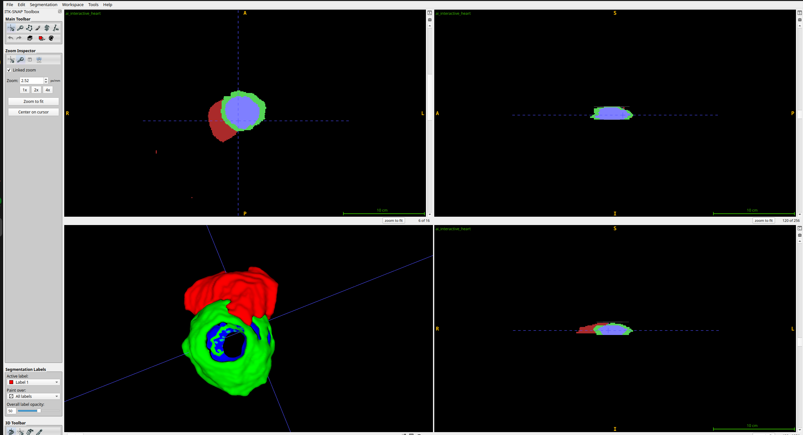

# 3D Cardiac MRI Volumetric Segmentation Pipeline 🫀

[](https://www.python.org/)
[](https://pytorch.org/)
[]()
[]()

## 📌 Executive Summary
This repository houses an enterprise-grade, end-to-end 3D deep learning framework designed for automated volumetric segmentation of cardiac anatomy from high-resolution Magnetic Resonance Imaging (MRI) scans. Built upon a 3D U-Net architecture, the system directly processes multi-slice spatial NIfTI (`.nii.gz`) volumes to extract precise boundaries of cardiac structures, including the left/right ventricles and myocardium.

Engineered specifically for execution on headless **Linux High-Performance Computing (HPC)** clusters, the pipeline strictly enforces a separation between core execution logic, heavy model checkpoints (`.pth`), and raw clinical datasets.

---

## 🎥 Interactive 3D Model Render & Video Demo

To demonstrate the full spatial continuity of the reconstructed mesh output:

* 🎬 **[Watch the Interactive 3D Model Rendering Video](https://drive.google.com/file/d/1MmrZ9pN2rCyANHrYETShj5f4mRX-wGdq/view?usp=sharing)**

---

## 📊 Qualitative & Visual Results

The output tensor generated by the inference module (`ai_interactive_heart.nii.gz`) is exported as a standard medical volume. Because it retains its original affine metadata, it is fully compatible with standard clinical viewers such as ITK-SNAP.

### Multi-Planar & 3D Volumetric Reconstruction
Below is the evaluation output demonstrating predicted boundaries overlaid across sequential depth slices (axial, coronal, sagittal), alongside the fully isolated 3D anatomical mesh.


*Figure 1: Multi-class segmentation mask isolating distinct cardiac regions, visualized natively within ITK-SNAP.*

---

## 🏗️ System Architecture & Engineering Specifications

### 1. Model Topology (3D U-Net)
The core segmentation engine utilizes a symmetrical encoder-decoder network extended to 3D spatial convolutions ($C \times D \times H \times W$):
* **Encoder:** 4 resolution levels utilizing strided 3D convolutions $(2, 2, 2)$ for feature extraction and spatial downsampling, doubling feature channels at each depth ($16 \to 32 \to 64 \to 128 \to 256$).
* **Decoder:** Transposed 3D convolutions with residual skip connections to preserve high-frequency spatial localization details during upsampling.
* **Loss Function:** Combined Soft Dice Loss and Cross-Entropy Loss to handle severe foreground-to-background class imbalance:

$$L_{\text{total}} = L_{\text{Dice}} + \lambda L_{\text{CE}}$$

### 2. Module Blueprint
```text
├── dataset.py            # Data ingestion, spatial padding, deterministic tensor formatting
├── train.py              # Distributed training loop & model checkpointing
├── simulate_data.py      # Noise-injection testing module for out-of-distribution stability
├── evaluate.py           # Production inference pipeline; exports .nii.gz volumetric masks
├── submit.sh             # SLURM execution script for headless Linux HPC clusters
└── .gitignore            # Ignores data/ and *.pth files to maintain lightweight repo size
